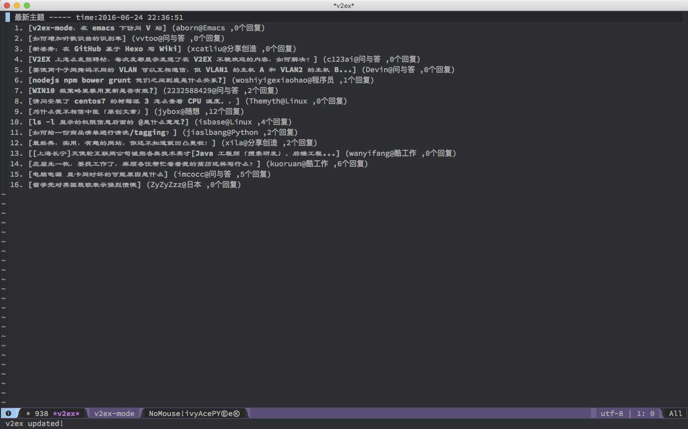

# v2ex-mode
[](https://travis-ci.org/aborn/v2ex-mode)  
v2ex-mode, visiting [http://v2ex.com/](http://v2ex.com/) freely in emacs.

## Install
Install it from elpa package source (i.e. [melpa](https://melpa.org/) or [popkit elpa](https://elpa.popkit.org/)).  
```elisp
M-x package-install v2ex-mode
(require 'v2ex-mode)    ;; put this line code into your initial file.
```

Or, you can install it manually, download **v2ex-mode.el** file to **\<your-local-directory>**, and
and add-to-list load-path and load it.  
```elisp
(add-to-list 'load-path "<your-local-directory>")
(load "v2ex-mode")
```

## Usage
```elisp
M-x v2ex
```

## Hotkey
In \*v2ex* buffer, following hot-key are supported:  
**h** -- fetch the hot topics;  
**l** -- fetch the latest topics;  
**r** -- reload the current content;  
**q** -- exit/quit kill & quit \*v2ex* buffer.

## Show
The content list are shown in \*v2ex* buffer.  

