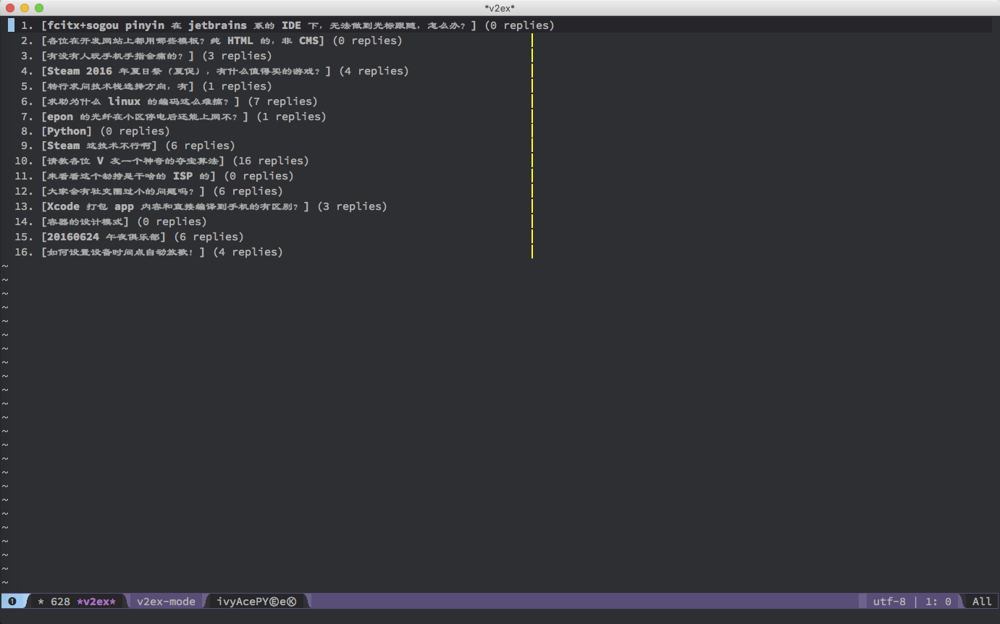

# v2ex-mode
v2ex-mode, visiting http://v2ex.com/ using emacs.

## Install
**1.** install it from elpa pakge source (i.e. [melpa](https://melpa.org/)).  
```elisp
M-x package-install v2ex-mode
```
**2.** put the folloing elisp snippet in your *init.el*(or *.emacs*) file.  
```elisp
(require 'v2ex-mode)
```

## Usage
```elisp
M-x v2ex
```

## Show

